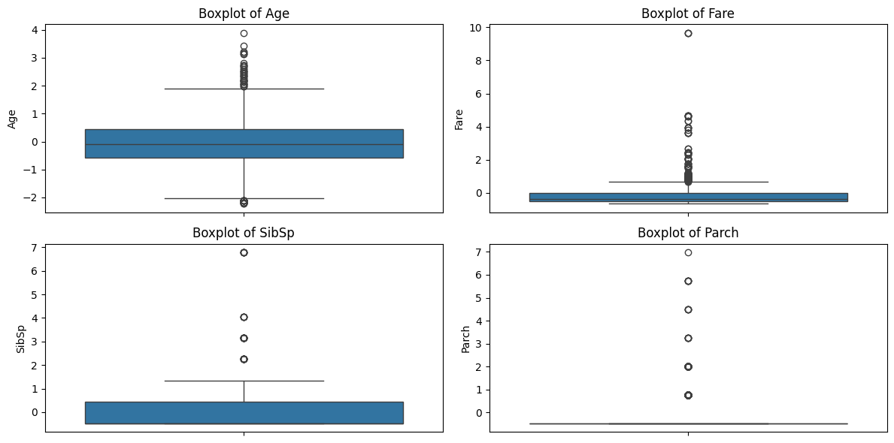

# ElevateLabs-AIML-Intern_Task-1
---

# 🚀 Task 1: Data Cleaning & Preprocessing

##  Objective
The goal of this task was to clean and prepare raw data for machine learning model training by performing:
- Handling missing values
- Encoding categorical data
- Normalizing numerical features
- Detecting and removing outliers

---

## 🛠️ Tools Used
- Python
- Pandas
- NumPy
- Matplotlib
- Seaborn
- Scikit-learn
- Google Colab

---

## 📊 Dataset
- **Dataset Name:** Titanic Dataset
- **Source:** Uploaded manually to Colab (available in `/dataset/titanic.csv`)

---

## 📖 Steps Performed

1. **Loaded and explored dataset**
   - Checked basic info, datatypes, null values.

2. **Handled missing values**
   - `Age` column filled with median.
   - `Embarked` filled with mode.
   - `Cabin` column dropped due to excessive missing values.

3. **Converted categorical columns**
   - `Sex` and `Embarked` converted to numerical labels using `LabelEncoder`.

4. **Standardized numerical columns**
   - Scaled `Age`, `Fare`, `SibSp`, `Parch` using `StandardScaler`.

5. **Visualized outliers**
   - Created boxplots for numerical columns.
   - Outliers detected using the IQR method and removed.

6. **Displayed cleaned data info**

---

## 📸 Screenshots
*Boxplots before outlier removal:*

> 

---

## 📁 Folder Structure

```

Task-1-Data-Cleaning-Preprocessing/
├── dataset/
│   └── Titanic.csv
├── images/
│   └── boxplots.png
├── Task\_1\_Data\_Cleaning\_Preprocessing.ipynb
├── README.md

````

---

##  How to Run

1. Upload `Titanic.csv` to Colab via:
   ```python
   from google.colab import files
   files.upload()
````

2. Run the notebook `Task_1_Data_Cleaning_Preprocessing.ipynb`

---

## 📚 Conclusion

Successfully completed data cleaning and preprocessing operations to prepare the Titanic dataset for further machine learning workflows.

---

##  Author

P. Yaswanth Kumar
